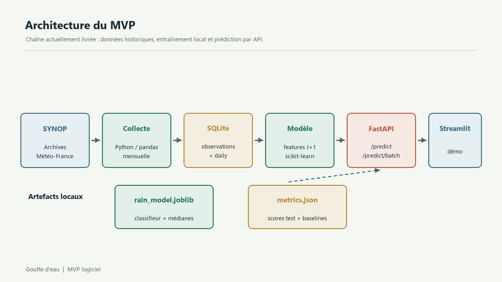
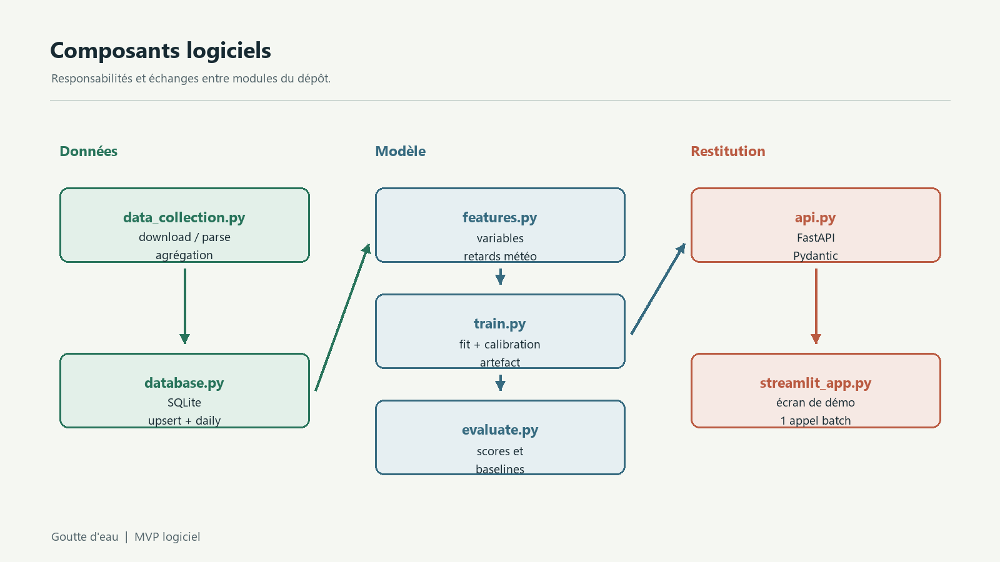
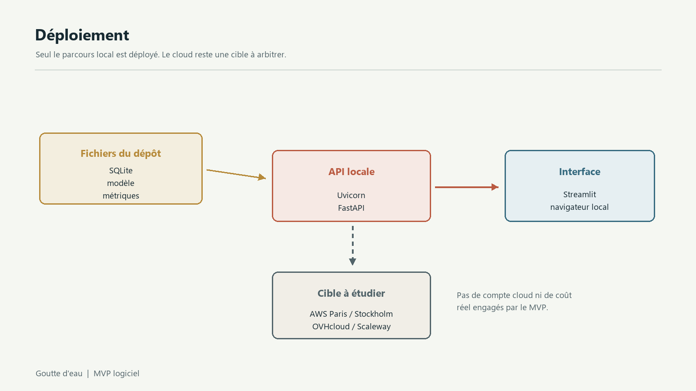
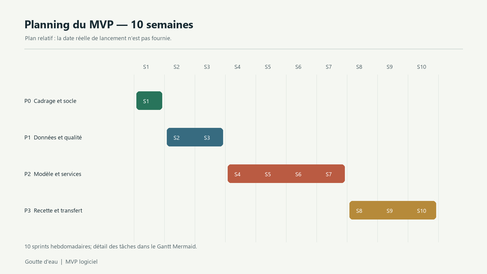
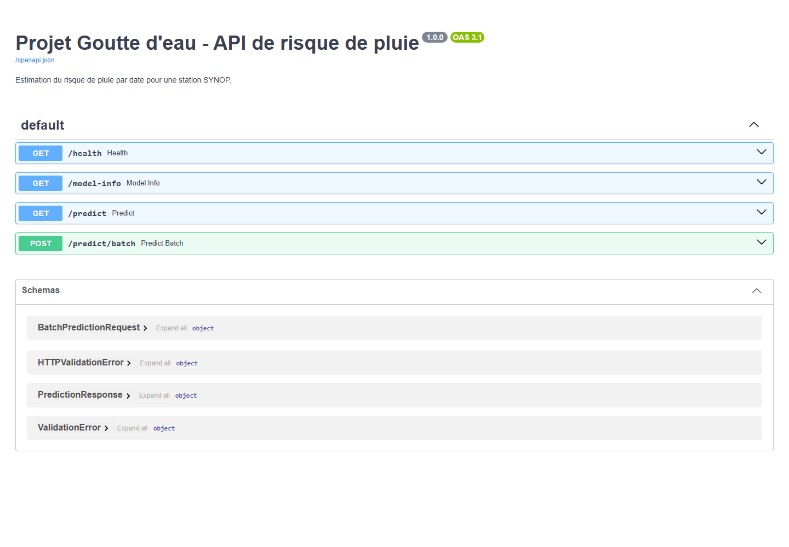
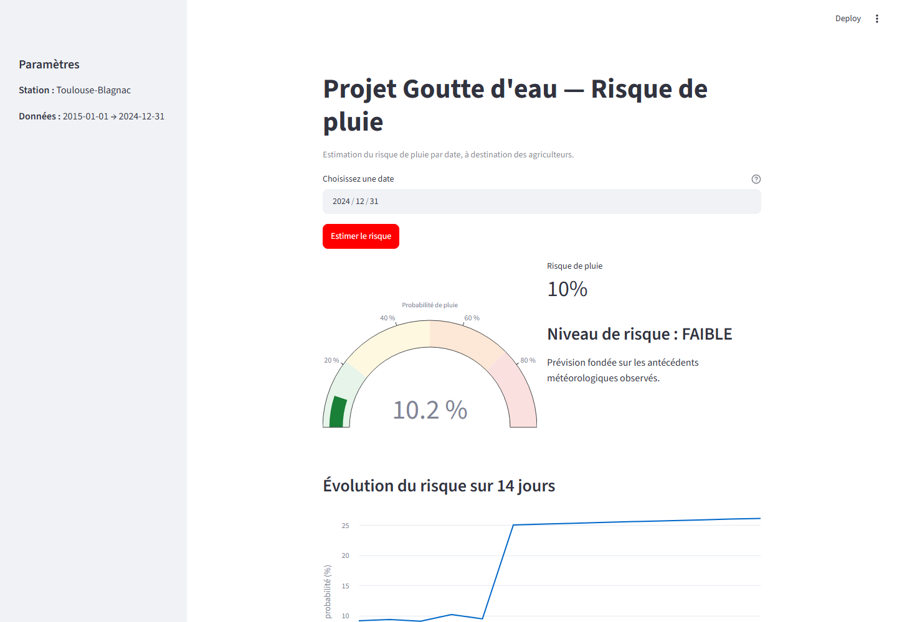
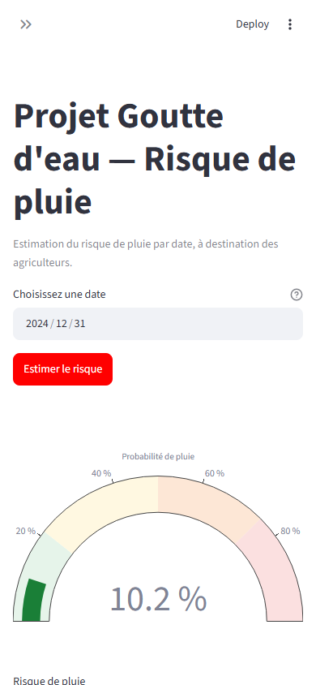

# Démarrage rapide

```bash
# 1. Environnement
python -m venv .venv
.venv\Scripts\activate          # Windows  (source .venv/bin/activate sous Linux/macOS)
pip install -r dependencies_versions.txt

# 2. Collecte des données SYNOP Météo-France (+ agrégats quotidiens)
python -m src.data_collection --start 2015 --end 2024

# Force le téléchargement des mois déjà présents (facultatif)
python -m src.data_collection --start 2015 --end 2024 --refresh

# 3. Entraînement + évaluation du modèle
python -m src.train

# 4. API de prédiction (http://127.0.0.1:8000/docs)
uvicorn src.api:app --reload

# 5. Interface de démonstration (http://127.0.0.1:8501)
streamlit run app/streamlit_app.py

# Tests
pytest -q
```

---

## Fonctionnalités du MVP

- **Collecte** des données SYNOP essentielles OMM (Licence Ouverte) et stockage **SQLite**.
- **Modèle** de prévision de pluie à J+1 (régression logistique calibrée) :
  saisonnalité + antécédents météorologiques.
- **API REST FastAPI** : risque de pluie en fonction d'une date (`/predict`).
- **Interface Streamlit** de démonstration : jauge de risque, courbe sur 14 jours (appel groupé), indicateurs qualité. La conformité RGAA/WCAG n'a pas été auditée.
- **Tests** automatisés (pytest) et **documentation** complète.

### Résultats du modèle (test 2023–2024)

| Indicateur                            | Valeur                                         |
| ------------------------------------- | ---------------------------------------------- |
| ROC-AUC                               | **0,7664**                                     |
| PR-AUC                                | 0,5043 (taux de base 0,2496)                   |
| Brier score                           | 0,1601                                         |
| Brier baseline (taux de base)         | 0,1882                                         |
| F1 / rappel (seuil validation 0,2124) | 0,551 / **0,745**                              |
| Précision des alertes                 | 0,437 (objectif > 0,90 non atteint)            |
| CodeCarbon entraînement               | 0,0027 gCO₂e estimés pour une exécution locale |

---

## Structure du dépôt

```
goutte-deau-mvp/
├── config.py                 # Paramètres (station, période, chemins)
├── dependencies_versions.txt
├── src/
│   ├── database.py           # Schéma & accès SQLite
│   ├── data_collection.py    # Collecte SYNOP → base
│   ├── features.py           # Feature engineering
│   ├── train.py              # Entraînement & sélection de modèle
│   ├── evaluate.py           # Métriques & indicateurs qualité
│   └── api.py                # API FastAPI
├── app/
│   └── streamlit_app.py      # Interface de démonstration
├── tests/test_mvp.py         # Tests pytest
├── scripts/smoke_api.py      # Test de fumée de l'API
└── docs/
    ├── 01-planification.md         # Planning, budget, schéma directeur
    ├── 02-architecture.md          # Diagrammes architecture & composants
    ├── 03-documentation-technique.md
    └── 04-eco-responsabilite-accessibilite.md # Green IT, hébergement responsable & RGAA/WCAG
```

---

## 📄 Document explicatif du travail effectué

Le projet a été mené dans l'ordre suivant :

1. **Cadrage & planification** — Scrum est la méthode retenue dans l'EdC-01; la durée des sprints, le budget et l'outillage sont des hypothèses précisées ici. Le MVP est cadré sur 10 semaines et son budget RH recalculé est de 84 k€.
   → [`docs/01-planification.md`](docs/01-planification.md).
2. **Architecture** — diagrammes d'architecture, composants et déploiement en Mermaid; GitHub les affiche directement. Les sources sont dans [`docs/diagrams`](docs/diagrams/) et les explications dans [`docs/02-architecture.md`](docs/02-architecture.md).
3. **Données** — SYNOP Météo-France, collecte idempotente et incrémentale, SQLite (29 181 observations → 3 653 jours).
4. **Modèle** — prévision de pluie à J+1 (saisonnalité + persistance + pression),
   sélection par validation croisée temporelle, calibration des probabilités.
5. **Évaluation** — seuil sélectionné sur la validation 2022, test final 2023–2024 et comparaison Brier au taux de base et à la persistance.
6. **API** — FastAPI avec réponses Pydantic : `/predict`, `/predict/batch`, `/health`, `/model-info`.
7. **Interface** — démonstration Streamlit; aucune conformité d'accessibilité n'est revendiquée avant audit.
8. **Documentation** — technique, éco-responsabilité, accessibilité, tests.

Le PDF EdC-01 fourni confirme les besoins, les rôles, le backlog et le choix Scrum; il ne contient pas les montants 147 k€/550 k€, le choix AWS, Jira ni une durée de sprint. Ces éléments précédemment attribués à EdC-01 ont été retirés ou requalifiés, sans modifier EdC-01. Les choix et limites sont détaillés dans
[`docs/03-documentation-technique.md`](docs/03-documentation-technique.md).

L'étude d'hébergement responsable est dans [`docs/05-hebergement-responsable.md`](docs/05-hebergement-responsable.md). Le modèle et les métriques versionnés, ainsi qu'un export de `daily`, permettront de vérifier le service hors ligne sans relancer la collecte réseau. Les captures de `/docs` et Streamlit et la preuve d'un vrai backlog collaboratif restent à joindre après génération/configuration dans l'environnement GitHub.

## Diagrammes

Les diagrammes sont lisibles directement dans GitHub et leurs PNG sont intégrés au DOCX :









Pour régénérer les annexes, installer `requirements-docs.txt`, puis lancer `python scripts/render_diagrams.py` et `python scripts/update_docx_deliverable.py`. Les captures exigent aussi `python -m playwright install chromium`, l'API et Streamlit démarrés, puis `python scripts/capture_screenshots.py`.

## Captures







---
