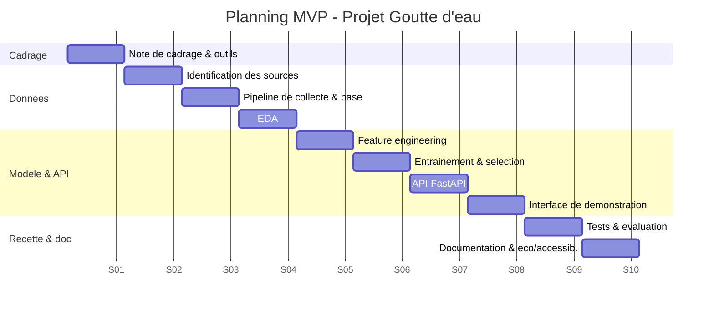

# 1. Planification du projet — Projet Goutte d'eau

> Compétences couvertes : **C7** (organisation du travail de l'équipe-projet),
> **C8** (outils de travail collaboratif), **C9** (budget prévisionnel),
> **C10** (schéma directeur / calendrier).

---

## 1.1 Contexte et cadrage

France Météo souhaite refondre ses algorithmes de prévision des pluies en
s'appuyant sur l'intelligence artificielle et les flux de capteurs IoT, à
destination des **agriculteurs**. Le présent document planifie **le projet
complet** (de l'idée à la mise en service) et situe le **MVP** dans cette
trajectoire.

| Élément | Description |
|---|---|
| **Objectif produit** | Fournir aux agriculteurs une estimation fiable du risque de pluie par zone et par date. |
| **Objectif du MVP** | Démontrer la chaîne complète *collecte → stockage → modèle → API → interface* sur **une seule région** (Occitanie, station SYNOP de Toulouse-Blagnac). |
| **Commanditaire** | Direction de la prévision — France Météo. |
| **Sponsor** | Direction de la transformation digitale. |
| **Parties prenantes** | Agriculteurs (utilisateurs finaux), chambres d'agriculture, Data Scientists, Data Engineers, DSI, RSSI, direction financière, DPO. |

### Objectifs SMART

1. Livrer un **MVP fonctionnel** (API + interface de démonstration) en **10 semaines**.
2. Atteindre un **ROC-AUC ≥ 0,75** sur la prédiction « jour pluvieux / sec ».
3. Temps de réponse de l'API **< 300 ms** (P95).
4. **100 % des données** issues de sources ouvertes et traçables (Licence Ouverte).

---

## 1.2 Méthode de gestion de projet retenue (C7)

**Méthode agile hybride : Scrumban.**

| Critère | Justification |
|---|---|
| Incertitude forte (R&D, data science exploratoire) | L'agile permet d'itérer sur le modèle sans figer les specs. |
| Livrable incrémental (MVP d'abord) | Sprints courts avec démonstration à chaque fin d'itération. |
| Petite équipe pluridisciplinaire | Scrum léger + tableau Kanban (flux) = Scrumban. |

- **Sprints de 2 semaines**, cérémonies : planning, daily stand-up (15 min),
  revue de sprint, rétrospective.
- **Définition of Done (DoD)** : code revu (pull request), testé, documenté,
  déployé en environnement de recette.
- **Gestion des risques** : revue hebdomadaire du registre des risques (§1.7).

### Équipe-projet et rôles (RACI synthétique)

| Rôle | Responsabilité principale | Charge MVP |
|---|---|---|
| **Product Owner** | Priorise le backlog, porte la voix des agriculteurs | 0,3 ETP |
| **Scrum Master / Chef de projet** | Anime la méthode, lève les blocages | 0,3 ETP |
| **Data Scientist (pilote)** | Modélisation, évaluation, features | 1 ETP |
| **Data Engineer** | Pipeline de collecte, base de données, API | 1 ETP |
| **Développeur Front / UX** | Interface, accessibilité | 0,5 ETP |
| **DevOps / SRE** | CI/CD, hébergement, supervision | 0,3 ETP |
| **Référent sécurité (RSSI) / DPO** | Conformité, RGPD, sécurité | 0,1 ETP |

---

## 1.3 WBS — Découpage en lots (Work Breakdown Structure)

```
Projet Goutte d'eau
├── 1. Cadrage & gouvernance
│   ├── 1.1 Note de cadrage, objectifs SMART
│   ├── 1.2 Registre des parties prenantes & des risques
│   └── 1.3 Mise en place des outils collaboratifs
├── 2. Données (C13, C14)
│   ├── 2.1 Identification des sources (Météo-France SYNOP / Infoclimat)
│   ├── 2.2 Pipeline de collecte & d'ingestion
│   └── 2.3 Modèle de données & base SQLite (MVP) / PostgreSQL (cible)
├── 3. Modélisation IA
│   ├── 3.1 Analyse exploratoire (EDA)
│   ├── 3.2 Feature engineering
│   ├── 3.3 Entraînement & sélection de modèle
│   └── 3.4 Évaluation & indicateurs qualité
├── 4. Architecture & API (C11)
│   ├── 4.1 Diagramme d'architecture & de composants
│   ├── 4.2 API de prédiction (FastAPI)
│   └── 4.3 Sécurité & scalabilité
├── 5. Interface utilisateur (C15)
│   ├── 5.1 Maquette & accessibilité (RGAA/WCAG)
│   └── 5.2 Interface de démonstration (Streamlit)
├── 6. Éco-responsabilité (C12)
│   ├── 6.1 Bonnes pratiques Green IT
│   └── 6.2 Étude des hébergements responsables
└── 7. Industrialisation
    ├── 7.1 CI/CD, tests, qualité
    ├── 7.2 Déploiement & supervision
    └── 7.3 Documentation & transfert
```

---

## 1.4 Schéma directeur & calendrier (C10)

Le projet complet est phasé ; le **MVP correspond aux phases 1 à 3**.

| Phase | Contenu | Durée | Jalon |
|---|---|---|---|
| **P0 — Cadrage** | Note de cadrage, outils, backlog initial | S1 | J0 : lancement |
| **P1 — Données & socle** | Collecte, base, EDA | S2–S4 | J1 : jeu de données prêt |
| **P2 — Modèle & API (MVP)** | Entraînement, évaluation, API, interface démo | S5–S8 | **J2 : MVP démontrable** |
| **P3 — Recette & doc** | Tests, documentation, éco-conception, accessibilité | S9–S10 | J3 : MVP validé |
| **P4 — Industrialisation** | CI/CD, cloud, multi-régions | S11–S18 | J4 : V1 en production |
| **P5 — Généralisation** | Déploiement national, IoT temps réel | S19+ | J5 : mise en service |

### Diagramme de Gantt (MVP, phases P0–P3)



---

## 1.5 Outils de travail collaboratif (C8)

| Besoin | Outil retenu | Justification / paramétrage |
|---|---|---|
| Gestion du backlog / Kanban | **GitHub Projects** (ou Jira) | Lié aux issues et pull requests, tableau Scrumban. |
| Code & revue | **GitHub / GitLab** | Branches, pull requests, revue obligatoire (2 approbations). |
| CI/CD | **GitHub Actions** | Tests + lint automatiques à chaque push. |
| Documentation | **Markdown dans le repo** + Wiki | Versionnée avec le code (*docs-as-code*). |
| Communication | **Mattermost / Teams** | Canaux `#dev`, `#data`, `#incidents`. |
| Visio & cérémonies | **Teams / Jitsi** | Daily, revues de sprint. |
| Gestion documentaire | **Nextcloud** | Alternative souveraine et éco-responsable au drive propriétaire. |

**Paramétrage clé** : protection de la branche `main` (pas de push direct,
revue obligatoire, CI verte requise), modèles d'issues/PR, conventions de
commits, droits d'accès par rôle (principe du moindre privilège).

---

## 1.6 Budget prévisionnel (C9)

Hypothèse : **MVP sur 10 semaines (~2,5 mois)**, coûts chargés indicatifs.

### Coûts de ressources humaines

| Profil | ETP | Coût mensuel chargé (€) | Durée (mois) | Total (€) |
|---|---:|---:|---:|---:|
| Data Scientist | 1,0 | 8 500 | 2,5 | 21 250 |
| Data Engineer | 1,0 | 8 000 | 2,5 | 20 000 |
| Dév. Front / UX | 0,5 | 7 000 | 2,5 | 8 750 |
| DevOps / SRE | 0,3 | 8 000 | 2,5 | 6 000 |
| Product Owner | 0,3 | 7 500 | 2,5 | 5 625 |
| Scrum Master / CP | 0,3 | 7 500 | 2,5 | 5 625 |
| **Sous-total RH** | | | | **67 250** |

### Coûts techniques (MVP)

| Poste | Détail | Coût (€) |
|---|---|---:|
| Hébergement cloud (recette) | VM éco-responsable (ex. Scaleway/OVHcloud) 2,5 mois | 450 |
| Stockage & sauvegarde | Objet S3 compatible, faible volume | 100 |
| Outils (CI/CD, suivi) | Offres gratuites open-source / seuils gratuits | 0 |
| Données | Sources ouvertes (Licence Ouverte) | 0 |
| **Sous-total technique** | | **550** |

### Synthèse

| Rubrique | Montant (€) |
|---|---:|
| Ressources humaines | 67 250 |
| Technique | 550 |
| **Sous-total** | **67 800** |
| Provision risques (10 %) | 6 780 |
| **Budget prévisionnel MVP** | **≈ 74 580 €** |

> Estimation indicative pour la phase P4 (industrialisation / cloud managé,
> multi-régions) : **150 000 à 250 000 €** supplémentaires selon le périmètre.

---

## 1.7 Registre des risques (extrait)

| Risque | Prob. | Impact | Parade |
|---|---|---|---|
| Qualité/trous dans les données SYNOP | Moyen | Élevé | Nettoyage, imputation, contrôle qualité automatisé. |
| Modèle peu performant (date seule) | Élevé | Moyen | Ajout de variables (saisonnalité, historique) ; cadrer les attentes. |
| Dérive climatique (non-stationnarité) | Moyen | Moyen | Ré-entraînement périodique, suivi des métriques. |
| Dépendance à une source externe | Faible | Élevé | Cache local, bascule de source, archivage. |
| Dette technique MVP | Moyen | Moyen | Refactor planifié en P4, tests automatisés. |

---

## 1.8 Indicateurs de pilotage

- **Avancement** : vélocité des sprints, burndown chart.
- **Qualité produit** : ROC-AUC, F1, Brier score (cf. `docs/03-documentation-technique.md`).
- **Qualité logicielle** : couverture de tests, taux de PR revues, temps de build CI.
- **Éco-responsabilité** : estimation de l'empreinte (kWh / gCO₂e) du pipeline.
