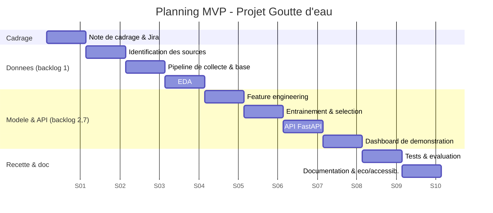

# 1. Planification du projet — Projet Goutte d'eau

> Compétences couvertes : **C7** (organisation du travail de l'équipe-projet),
> **C8** (outils de travail collaboratif), **C9** (budget prévisionnel),
> **C10** (schéma directeur / calendrier).

---

## 1.1 Contexte et cadrage

> **Continuité avec l'étude de cas n°1 (Analyse des besoins).** Ce document de
> Bloc 2 (conception et développement de l'architecture fonctionnelle) reprend
> le cadrage, les objectifs, les personas, le budget et le backlog définis dans
> le **cahier des charges du Projet Goutte d'Eau** (EdC-01) et les traduit en
> **planification de réalisation** et en **MVP**.

Le **Projet Goutte d'Eau** vise à refondre les algorithmes de prévision des
pluies en exploitant l'**IA** et les **données de capteurs IoT**, afin d'offrir
aux **agriculteurs**, **collectivités** et **services de gestion des risques
(SDIS)** une anticipation précise et rapide des précipitations. Le présent
document planifie **le projet complet** (de l'idée à la mise en service) et
situe le **MVP** dans cette trajectoire.

| Élément               | Description                                                                                                                                                                                                            |
| --------------------- | ---------------------------------------------------------------------------------------------------------------------------------------------------------------------------------------------------------------------- |
| **Objectif produit**  | Prévoir le risque de pluie avec une précision horaire au km² sur 24 h, avec alertes multicanal, pour les agriculteurs, collectivités et SDIS.                                                                          |
| **Objectif du MVP**   | Démontrer la chaîne complète _collecte → stockage → modèle → API → interface_ sur **une seule zone pilote** : l'aire de **Toulouse (station SYNOP Toulouse-Blagnac, Occitanie)**, grande région agricole du Sud-Ouest. |
| **Commanditaire**     | Direction de la prévision — France Météo.                                                                                                                                                                              |
| **Sponsor**           | Direction de la transformation digitale.                                                                                                                                                                               |
| **Parties prenantes** | Agriculteurs (utilisateurs majoritaires), SDIS / gestionnaires de risques, collectivités / urbanisme, chambres d'agriculture, Data Scientists, Ingénieur IoT, Développeurs, DSI, RSSI, direction financière, DPO.      |

### Objectifs produit (SMART, repris de l'EdC-01)

1. **Précision** des prévisions de pluie à **24 h** (indicateurs **RMSE / MAE** conformes aux objectifs).
2. **Granularité** spatiale au **km²** et temporelle au **¼ d'heure**.
3. **Fraîcheur** : mise à jour des prévisions en **moins de 5 minutes** après réception de nouvelles mesures.
4. **Fiabilité des alertes** : **taux d'alertes valides > 90 %**.
5. **Satisfaction** d'au moins **80 %** d'un panel de **50 agriculteurs testeurs**.

### Objectifs techniques du MVP (première brique)

Le MVP ne couvre pas d'emblée l'ensemble des cibles ci-dessus (réseau IoT et
régression fine de la quantité de pluie viendront ensuite). Il **valide la
chaîne de bout en bout** sur la prévision d'**occurrence** de pluie :

1. Livrer un **MVP fonctionnel** (pipeline données + modèle + API + interface de démonstration).
2. Atteindre un **ROC-AUC ≥ 0,75** sur la prédiction « jour pluvieux / sec » (indicateur technique d'étape).
3. **100 % des données** issues de sources ouvertes et traçables (SYNOP Météo-France, Licence Ouverte), en attendant le déploiement des capteurs IoT.

---

## 1.2 Méthode de gestion de projet retenue (C7)

**Méthode retenue dans l'EdC-01 : Agile Scrum, outillée par Jira.**

Un benchmark (cycle en V, Scrum, Kanban) avait conclu, en EdC-01, à la
pertinence de **Scrum** : itérations courtes, livraison rapide d'un MVP
fonctionnel, adaptation continue face à l'incertitude R&D/data science.

| Critère                                            | Justification                                                     |
| -------------------------------------------------- | ----------------------------------------------------------------- |
| Incertitude forte (R&D, data science exploratoire) | Scrum permet d'itérer sur le modèle sans figer les specs.         |
| Livrable incrémental (MVP d'abord)                 | Sprints courts avec démonstration à chaque fin d'itération.       |
| Scalabilité de l'outillage                         | **Jira** : standard du marché, maîtrisé, scalable au-delà du MVP. |

- **Sprints de 2 semaines**, cérémonies : planning, daily stand-up (15 min),
  revue de sprint, rétrospective.
- **Backlog priorisé** (cf. §1.4) géré dans **Jira**, découpage en _epics_
  BACK / FRONT.
- **Définition of Done (DoD)** : code revu (pull request), testé, documenté,
  déployé en environnement de recette.
- **Gestion des risques** : revue hebdomadaire du registre des risques (§1.8).

### Équipe-projet et rôles (reprise de l'EdC-01)

L'EdC-01 a dimensionné l'équipe suivante (coûts annuels chargés indiqués au
budget, §1.6). Les ETP ci-dessous correspondent à la **phase MVP**.

| Rôle                                         | Responsabilité principale                                        | ETP MVP             |
| -------------------------------------------- | ---------------------------------------------------------------- | ------------------- |
| **Chef de projet** (transformation digitale) | Cadrage, pilotage, animation Scrum, voix du client               | 0,6 ETP             |
| **Ingénieur IoT**                            | Déploiement et intégration des capteurs IoT (zone pilote 50 km²) | 1 ETP (déploiement) |
| **Data Scientist ×2**                        | Modélisation, features, évaluation, calibration                  | 2 × 1 ETP           |
| **UX designer**                              | Conception de l'interface, accessibilité                         | 0,5 ETP             |
| **Développeur ×2**                           | Pipeline, API, dashboard, notifications, intégrations            | 2 × 1 ETP           |
| **RSSI / DPO** (appui transverse)            | Conformité RGPD, sécurité, gouvernance des biais                 | appui               |

> Le MVP mobilise prioritairement les **Data Scientists** et **Développeurs**
> (chaîne données → modèle → API → interface) ; l'**Ingénieur IoT** prépare le
> déploiement des capteurs sur la zone pilote de Toulouse.

---

## 1.3 WBS — Découpage en lots (Work Breakdown Structure)

```
Projet Goutte d'eau
├── 1. Cadrage & gouvernance
│   ├── 1.1 Note de cadrage, objectifs SMART
│   ├── 1.2 Registre des parties prenantes & des risques
│   └── 1.3 Mise en place des outils collaboratifs (Jira, dépôt Git)
├── 2. Données (C13, C14)
│   ├── 2.1 Sources : SYNOP Météo-France (MVP) + capteurs IoT terrain (cible)
│   ├── 2.2 Pipeline de collecte & d'ingestion (batch MVP → temps réel)
│   └── 2.3 Modèle de données & base SQLite (MVP) / PostgreSQL + PostGIS (cible)
├── 3. Modélisation IA
│   ├── 3.1 Analyse exploratoire (EDA)
│   ├── 3.2 Feature engineering
│   ├── 3.3 Entraînement & sélection de modèle
│   └── 3.4 Évaluation & indicateurs qualité (ROC-AUC puis RMSE/MAE)
├── 4. Architecture & services (C11)
│   ├── 4.1 Diagramme d'architecture & de composants
│   ├── 4.2 API de prédiction (FastAPI)
│   ├── 4.3 Authentification des utilisateurs
│   ├── 4.4 Service de notifications multicanal (SMS, mail, push)
│   └── 4.5 Sécurité & scalabilité
├── 5. Interface utilisateur (C15)
│   ├── 5.1 Maquette & accessibilité (RGAA/WCAG)
│   ├── 5.2 Dashboard (MVP) et interface de démonstration (Streamlit)
│   └── 5.3 Historique / statistiques, carte interactive (lots ultérieurs)
├── 6. Éco-responsabilité (C12)
│   ├── 6.1 Bonnes pratiques Green IT / Green AI
│   └── 6.2 Optimisation de l'hébergement (cloud AWS, cf. EdC-01)
└── 7. Industrialisation
    ├── 7.1 CI/CD, tests, qualité
    ├── 7.2 Déploiement & supervision
    └── 7.3 Documentation & transfert
```

---

## 1.4 Backlog produit (repris de l'EdC-01)

Le backlog priorisé défini dans le cahier des charges (EdC-01) structure la
réalisation. Les éléments **réalisés ou amorcés dans le MVP** sont signalés.

| ID  | Epic / Fonctionnalité                                              | Priorité | Est. (j) | Couverture MVP                                 |
| --- | ------------------------------------------------------------------ | -------- | -------: | ---------------------------------------------- |
| 1   | **BACK — Recueil des données** (collecte capteurs / sources météo) | Extrême  |        7 | ✅ Collecte SYNOP (proxy des capteurs)         |
| 2   | **BACK — Algo prévisions** (modèle de traitement des données)      | Extrême  |       20 | ✅ Modèle de prévision de pluie (occurrence)   |
| 3   | **BACK — Automatisation** (rafraîchissement des prévisions)        | Extrême  |        7 | ◻ Pipeline idempotent (ordonnancement à venir) |
| 4   | **FRONT — Identification utilisateur** (authentification)          | Haute    |        3 | ◻ Lot ultérieur                                |
| 5   | **FRONT — Dashboard** (tableau de bord MVP)                        | Haute    |       10 | ✅ Interface de démonstration (Streamlit)      |
| 6   | **Notifications** (alertes multicanal)                             | Haute    |        5 | ◻ Spécifié (archi §2), non implémenté          |
| 7   | **APIs externes** (intégration à d'autres services)                | Moyenne  |        7 | ✅ API REST FastAPI + OpenAPI                  |
| 8   | **FRONT — Historique & statistiques** (exports)                    | Faible   |        3 | ◻ Lot ultérieur                                |
| 9   | **FRONT — Mobile** (application mobile)                            | Faible   |        7 | ◻ Lot ultérieur                                |
| 10  | **FRONT — Carte interactive** (stats temps réel + prévisions 24 h) | Faible   |        5 | ◻ Lot ultérieur                                |

> Le MVP se concentre sur le **chemin critique de valeur** : recueil des données
> (1), algorithme de prévision (2), exposition par API (7) et visualisation (5).

---

## 1.5 Schéma directeur & calendrier (C10)

Le projet complet est phasé ; le **MVP correspond aux phases P0 à P3**.

| Phase                       | Contenu                                                                 | Durée   | Jalon                    |
| --------------------------- | ----------------------------------------------------------------------- | ------- | ------------------------ |
| **P0 — Cadrage**            | Note de cadrage, outils (Jira), backlog initial                         | S1      | J0 : lancement           |
| **P1 — Données & socle**    | Collecte, base, EDA (backlog #1)                                        | S2–S4   | J1 : jeu de données prêt |
| **P2 — Modèle & API (MVP)** | Entraînement, évaluation, API, dashboard démo (backlog #2, #5, #7)      | S5–S8   | **J2 : MVP démontrable** |
| **P3 — Recette & doc**      | Tests, documentation, éco-conception, accessibilité                     | S9–S10  | J3 : MVP validé          |
| **P4 — Industrialisation**  | Automatisation, auth, notifications, cloud, IoT (backlog #3, #4, #6)    | S11–S20 | J4 : V1 en production    |
| **P5 — Généralisation**     | Déploiement multi-zones, mobile, carte, IoT temps réel (backlog #8–#10) | S21+    | J5 : mise en service     |

### Diagramme de Gantt (MVP, phases P0–P3)



---

## 1.6 Outils de travail collaboratif (C8)

| Besoin                       | Outil retenu                      | Justification / paramétrage                                              |
| ---------------------------- | --------------------------------- | ------------------------------------------------------------------------ |
| Gestion du backlog / sprints | **Jira** (choix EdC-01)           | Standard du marché, scalable, _epics_ BACK/FRONT, sprints de 2 semaines. |
| Code & revue                 | **GitHub / GitLab**               | Branches, pull requests, revue obligatoire (2 approbations).             |
| CI/CD                        | **GitHub Actions / GitLab CI**    | Tests + lint automatiques à chaque push.                                 |
| Documentation                | **Markdown dans le dépôt** + Wiki | Versionnée avec le code (_docs-as-code_).                                |
| Communication                | **Mattermost / Teams**            | Canaux `#dev`, `#data`, `#incidents`.                                    |
| Visio & cérémonies           | **Teams / Jitsi**                 | Daily, revues de sprint.                                                 |
| Gestion documentaire         | **Nextcloud**                     | Alternative souveraine et éco-responsable au drive propriétaire.         |

**Paramétrage clé** : protection de la branche `main` (pas de push direct,
revue obligatoire, CI verte requise), synchronisation Jira ↔ dépôt Git
(références de tickets dans les commits), conventions de commits, droits
d'accès par rôle (principe du moindre privilège).

---

## 1.7 Budget prévisionnel (C9)

Le budget reprend celui établi dans l'EdC-01 : un **budget annuel de
fonctionnement de 550 000 €** pour le projet complet, dont un **budget MVP de
147 000 €**.

### Budget annuel du projet complet (rappel EdC-01)

| Poste                         | Détail                                                                                                             | Montant (€) |
| ----------------------------- | ------------------------------------------------------------------------------------------------------------------ | ----------: |
| **Ressources humaines**       | Chef de projet (80 k), Ingénieur IoT (65 k), 2 Data Scientists (120 k), UX designer (45 k), 2 Développeurs (100 k) | **410 000** |
| **Matériel & infrastructure** | Serveurs cloud & stockage **AWS** (30 k), capteurs IoT (50 k), licences logicielles (15 k)                         |  **95 000** |
| **Coûts additionnels**        | Formation, communication, maintenance, énergie                                                                     |  **45 000** |
| **Total annuel**              |                                                                                                                    | **550 000** |

### Budget du MVP (147 000 €)

Le MVP mobilise une partie de l'équipe sur ~3 mois et déploie la zone pilote
(Toulouse, 50 km²).

| Poste                                    | Détail                                                                                                      |   Montant (€) |
| ---------------------------------------- | ----------------------------------------------------------------------------------------------------------- | ------------: |
| Ressources humaines (phase MVP, ~3 mois) | Chef de projet (0,6 ETP), 2 Data Scientists, 2 Développeurs, UX designer (0,5), Ingénieur IoT (déploiement) |      ≈ 84 000 |
| Capteurs IoT (zone pilote 50 km²)        | Déploiement initial du réseau de capteurs                                                                   |        50 000 |
| Cloud AWS & stockage                     | Environnements MVP (recette)                                                                                |         8 000 |
| Licences & outils                        | Jira, outils de développement (part MVP)                                                                    |         5 000 |
| **Budget prévisionnel MVP**              |                                                                                                             | **≈ 147 000** |

> **Note MVP pédagogique.** La brique logicielle réalisée dans ce dépôt
> (collecte SYNOP, modèle, API, interface) n'engage **aucun coût réel** :
> données en Licence Ouverte, exécution locale, outils open-source. Les montants
> ci-dessus correspondent au budget _projet_ tel que cadré en EdC-01, pour
> conserver la cohérence budgétaire entre les deux études de cas.

---

## 1.8 Registre des risques (extrait)

| Risque                                           | Prob.  | Impact | Parade                                                                                    |
| ------------------------------------------------ | ------ | ------ | ----------------------------------------------------------------------------------------- |
| Qualité/trous dans les données SYNOP             | Moyen  | Élevé  | Nettoyage, imputation, contrôle qualité automatisé.                                       |
| Classe « pluie » déséquilibrée (~22 % des jours) | Moyen  | Moyen  | Pondération des classes, seuil de décision optimisé, métriques adaptées (PR-AUC, rappel). |
| Retard de déploiement du réseau IoT              | Moyen  | Élevé  | Démarrer sur données ouvertes (SYNOP) ; IoT en incrément P4.                              |
| Dérive climatique (non-stationnarité)            | Moyen  | Moyen  | Ré-entraînement périodique, suivi des métriques.                                          |
| Dépendance à une source externe                  | Faible | Élevé  | Cache local, bascule de source, archivage.                                                |
| Dette technique MVP                              | Moyen  | Moyen  | Refactor planifié en P4, tests automatisés.                                               |

---

## 1.9 Indicateurs de pilotage

- **Avancement** : vélocité des sprints, burndown chart (Jira).
- **Qualité produit (cible EdC-01)** : RMSE/MAE (quantité de pluie), taux
  d'alertes valides (> 90 %), satisfaction panel (≥ 80 %), fraîcheur (< 5 min).
- **Qualité produit (MVP, étape)** : ROC-AUC, PR-AUC, Brier score
  (cf. `docs/03-documentation-technique.md`).
- **Qualité logicielle** : couverture de tests, taux de PR revues, temps de build CI.
- **Éco-responsabilité** : estimation de l'empreinte (kWh / gCO₂e) du pipeline.
