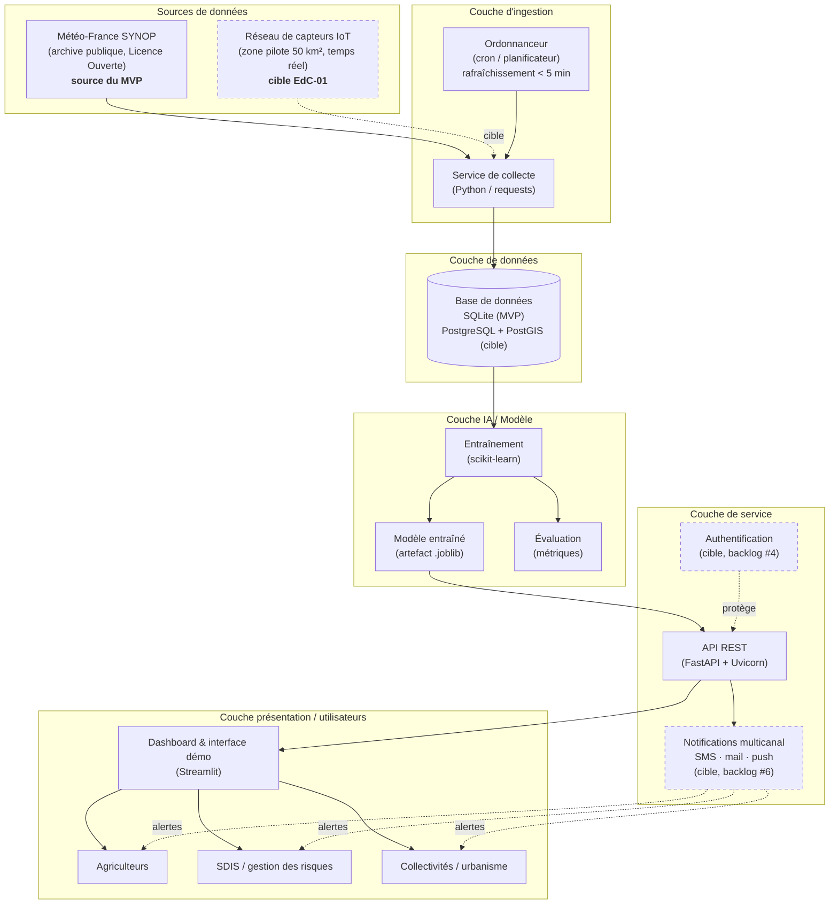
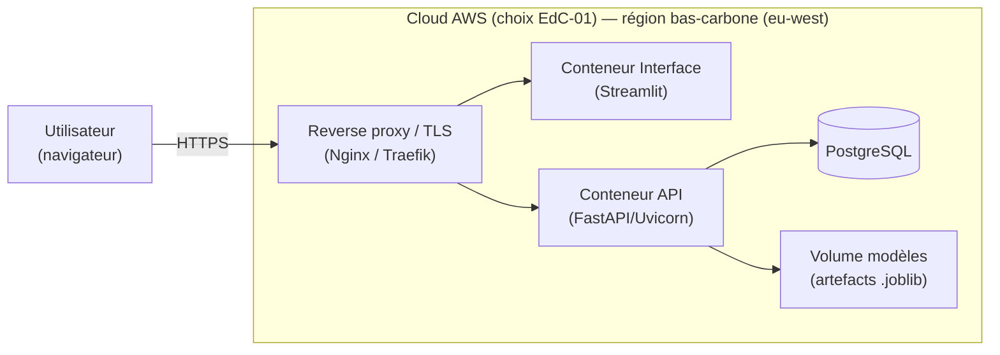
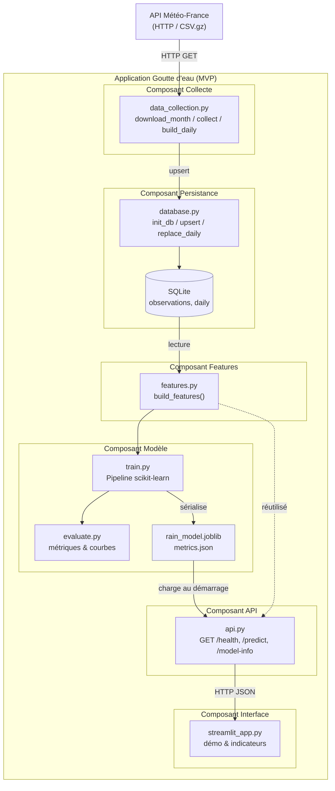

# 2. Architecture fonctionnelle de l'API (MVP)

> Ce document décrit l'architecture du MVP et les principales évolutions envisagées.

---

## 2.1 Principes directeurs

Le MVP utilise des archives SYNOP, SQLite, un modèle `.joblib` et une API FastAPI lancée localement. Il n'inclut pas encore l'authentification ni HTTPS. La suite pourrait ajouter des capteurs IoT, PostgreSQL/PostGIS, un déploiement cloud et une supervision adaptée à une mise à jour en moins de cinq minutes.

### Utilisateurs cibles (reprise de l'EdC-01)

Les utilisateurs envisagés sont les agriculteurs, les services de secours (SDIS) et les collectivités. Le MVP fournit une démonstration, pas encore un service d'alerte opérationnel.

---

## 2.2 Diagramme d'architecture

Vue d'ensemble du système, du MVP à la cible d'industrialisation.



### Vue de déploiement (cible)



## 2.3 Diagramme de composants

Détail des composants logiciels du MVP et de leurs interfaces.



## 2.4 Description des composants

- **Collecte** : `data_collection.py` télécharge et prépare les données avec `requests` et `pandas`.
- **Persistance** : `database.py` gère SQLite et les agrégats; PostgreSQL est envisagé pour la suite.
- **Features et modèle** : `features.py`, `train.py` et `evaluate.py` préparent les variables, entraînent le modèle et calculent les métriques avec `pandas`, `numpy` et `scikit-learn`.
- **API** : FastAPI expose les prédictions en JSON; le modèle est chargé depuis un fichier `.joblib`.
- **Interface** : Streamlit appelle l'API et affiche la démonstration et les indicateurs.

---

## 2.5 Contrat d'API (REST)

L'API expose trois routes :

- `GET /health` indique l'état du service, si le modèle est chargé et la plage de données disponible.
- `GET /model-info` renvoie les métriques et métadonnées du modèle.
- `GET /predict?date=YYYY-MM-DD` estime le risque de pluie pour la date demandée.
- `POST /predict/batch` accepte `{"dates": ["YYYY-MM-DD", ...]}` et renvoie les mêmes objets pour plusieurs dates (31 maximum).

Exemple de réponse `/predict` :

```json
{
	"date": "2025-07-14",
	"station": "Toulouse-Blagnac",
	"region": "Occitanie",
	"rain_probability": 0.23,
	"risk_level": "modéré",
	"threshold_mm": 1.0,
	"alert_probability_threshold": 0.2124,
	"based_on_history": true,
	"note": "Prévision fondée sur les antécédents météorologiques observés."
}
```

La réponse est validée par un modèle Pydantic. Les niveaux utilisent le seuil retenu sur la validation pour séparer `faible` de `modéré`; `threshold_mm` désigne séparément le seuil de pluie servant à définir la cible.

---

## 2.6 Sécurité, scalabilité, intégration

- **MVP** : les paramètres sont validés par FastAPI. Le projet ne gère pas de données personnelles et n'inclut pas encore d'authentification ni de configuration HTTPS.
- **Déploiement cible** : terminer la configuration TLS, gérer les secrets hors du code et ajouter l'authentification avant toute mise en production.
- **Intégration** : l'API REST expose sa documentation OpenAPI sur `/docs`. L'endpoint `/health` donne un contrôle simple de l'état du service.
- **Montée en charge** : conteneurs, base managée et supervision sont des pistes pour la suite, pas des composants du MVP actuel.

---

## 2.7 Trajectoire MVP → cible

Pour l'industrialisation, les principaux chantiers sont le passage de SQLite à PostgreSQL/PostGIS, la conteneurisation, l'ajout de stations et de données IoT, l'automatisation des déploiements et une supervision avec métriques et alertes. Le modèle pourra aussi être comparé à des méthodes de séries temporelles ou de gradient boosting.
