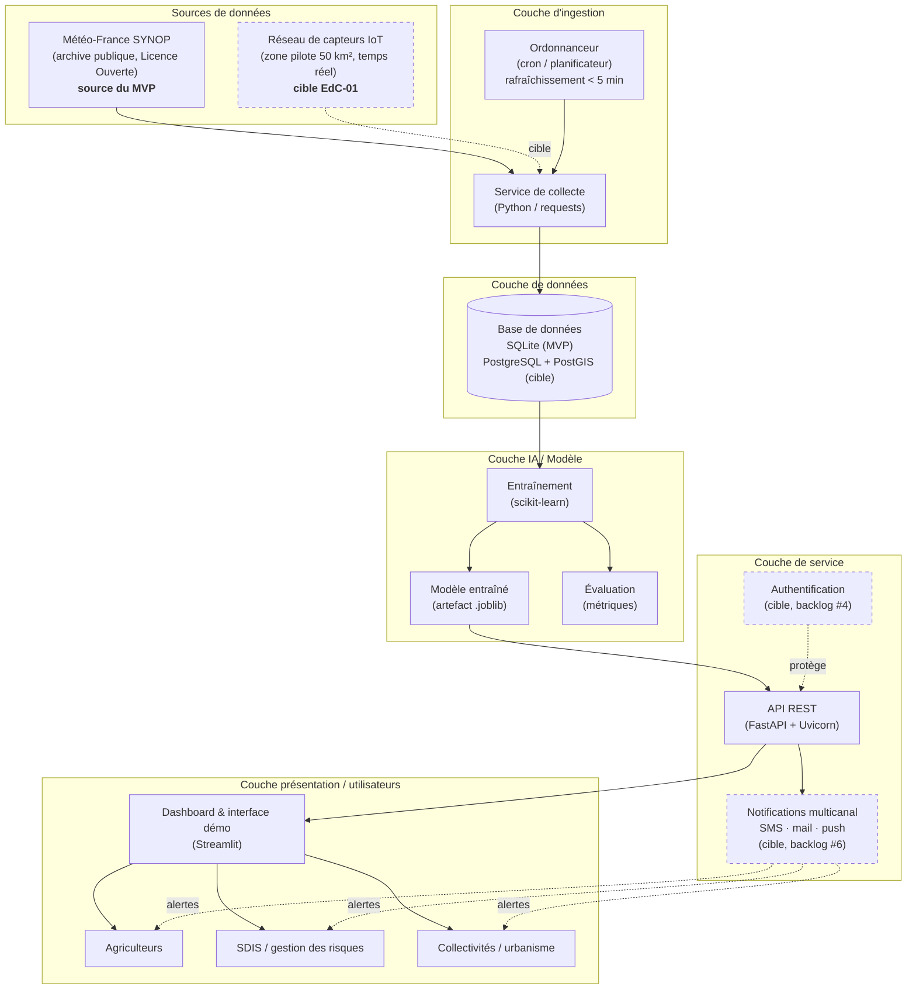
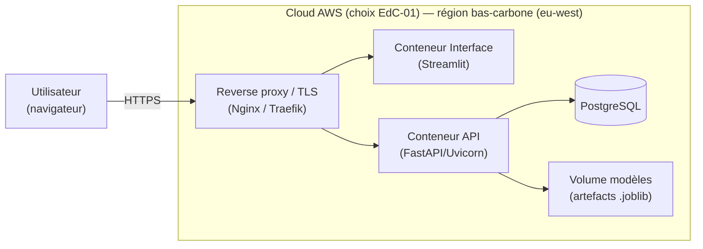
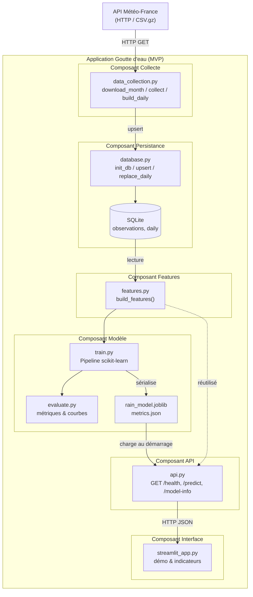

# 2. Architecture fonctionnelle de l'API (MVP)

> Compétences couvertes : **C11** (architecture fonctionnelle adaptée aux
> besoins métier, contraintes techniques, sécurité, scalabilité, intégration),
> **C13** (frameworks, plateformes, cloud, IA, IoT).

---

## 2.1 Principes directeurs

| Principe | Application dans le MVP |
|---|---|
| **Séparation des responsabilités** | Collecte, stockage, modèle, API et interface sont des composants distincts. |
| **Stateless API** | L'API ne conserve pas d'état entre requêtes → scalabilité horizontale. |
| **Modèle découplé** | Le modèle est un artefact versionné (`.joblib`) chargé au démarrage. |
| **Données hybrides** | SYNOP Météo-France (ouvertes, traçables) pour le MVP, **capteurs IoT** pour la cible temps réel (cf. EdC-01). |
| **Évolutivité** | Le MVP (SQLite + VM unique) évolue vers une cible cloud **AWS** (PostgreSQL + conteneurs, cf. budget EdC-01). |
| **Temps réel** | Architecture conçue pour une mise à jour des prévisions **< 5 min** après réception de nouvelles mesures (exigence EdC-01). |
| **Sécurité par conception** | Validation des entrées (Pydantic), HTTPS, moindre privilège, RGPD, pas de données personnelles dans le MVP. |

### Utilisateurs cibles (reprise de l'EdC-01)

L'architecture sert **trois profils** identifiés dans le cahier des charges :

- **Agriculteurs** (*Teddy, maraîcher*) — planification agricole (semis, récolte, irrigation) ;
- **Gestionnaires de risques / SDIS** (*Chantale, responsable SDIS*) — alertes pour la mobilisation des secours ;
- **Collectivités / urbanisme** (*Frédérick, urbaniste municipal*) — gestion des eaux pluviales, historique, zones sensibles.

---

## 2.2 Diagramme d'architecture

Vue d'ensemble du système, du MVP à la cible d'industrialisation.



### Vue de déploiement (cible)



---

## 2.3 Diagramme de composants

Détail des composants logiciels du MVP et de leurs interfaces.



---

## 2.4 Description des composants

| Composant | Responsabilité | Technologie | Interface |
|---|---|---|---|
| **Collecte** | Télécharger, nettoyer, filtrer les données SYNOP | Python, `requests`, `pandas` | Entrée : HTTP(S) ; Sortie : base |
| **Persistance** | Schéma, lecture/écriture, agrégats | SQLite (MVP) / PostgreSQL (cible) | SQL |
| **Features** | Transformer une date/un jour en variables modèle | `pandas`, `numpy` | Fonctions Python |
| **Modèle** | Entraîner, sérialiser, évaluer | `scikit-learn`, `joblib` | Artefacts `.joblib` / `.json` |
| **API** | Exposer la prédiction de risque de pluie | `FastAPI`, `Uvicorn`, `Pydantic` | REST / JSON |
| **Interface** | Démontrer le modèle, afficher les indicateurs | `Streamlit`, `plotly` | HTTP (appelle l'API) |

---

## 2.5 Contrat d'API (REST)

| Méthode | Route | Description | Réponse |
|---|---|---|---|
| `GET` | `/health` | Vérifie que le service et le modèle sont chargés | `{status, model_loaded}` |
| `GET` | `/model-info` | Métadonnées & métriques du modèle | `{station, metrics, trained_at, ...}` |
| `GET` | `/predict?date=YYYY-MM-DD` | **Risque de pluie** pour une date | `{date, rain_probability, risk_level, ...}` |

Exemple de réponse `/predict` :

```json
{
  "date": "2025-07-14",
  "station": "Montpellier-Frejorgues",
  "rain_probability": 0.23,
  "risk_level": "faible",
  "threshold_mm": 1.0
}
```

---

## 2.6 Sécurité, scalabilité, intégration (C11)

- **Sécurité** : validation stricte des entrées (Pydantic), HTTPS/TLS en façade,
  en-têtes de sécurité, pas de données à caractère personnel (RGPD *by design*),
  journalisation sans secret, gestion des secrets hors du code (variables
  d'environnement / coffre-fort).
- **Scalabilité** : API *stateless* → mise à l'échelle horizontale derrière un
  répartiteur ; base relationnelle managée ; modèle en lecture seule partagé.
- **Intégration** : API REST standard, documentée automatiquement via
  **OpenAPI/Swagger** (`/docs`), facilitant l'intégration par des clients tiers
  (future application mobile des agriculteurs, IoT).
- **Observabilité** : endpoint `/health`, métriques exposables (Prometheus en
  cible), journaux structurés.

---

## 2.7 Trajectoire MVP → cible

| Dimension | MVP | Cible (industrialisation) |
|---|---|---|
| Base de données | SQLite (fichier) | PostgreSQL managé + PostGIS |
| Déploiement | Processus locaux | Conteneurs Docker + orchestration |
| Données | 1 station, archive batch | Multi-stations + flux IoT temps réel |
| Modèle | Régression logistique / arbres | Modèles enrichis (gradient boosting, séries temporelles) |
| CI/CD | Tests locaux | GitHub Actions + déploiement continu |
| Supervision | `/health` | Métriques + alertes + traçage |
