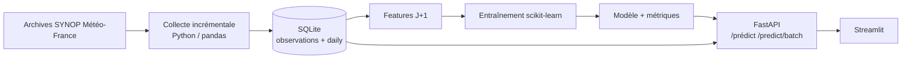

# Architecture du MVP

```mermaid
flowchart LR
    SYNOP["Archives SYNOP Météo-France"] --> COLLECT["Collecte incrémentale\nPython / pandas"]
    COLLECT --> SQLITE[("SQLite\nobservations + daily")]
    SQLITE --> FEATURES["Features J+1"]
    FEATURES --> TRAIN["Entraînement scikit-learn"]
    TRAIN --> ARTIFACT["Modèle + métriques"]
    ARTIFACT --> API["FastAPI\n/prédict /predict/batch"]
    SQLITE --> API
    API --> UI["Streamlit"]
```

Les capteurs, l'authentification et l'hébergement cloud ne sont pas déployés dans le MVP.
