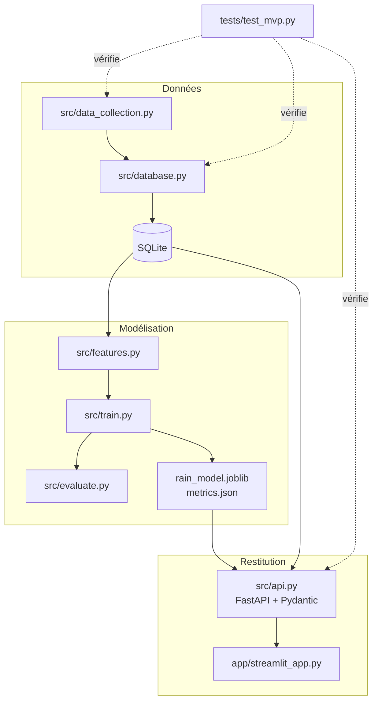

# Composants logiciels

```mermaid
flowchart TB
    subgraph Data["Données"]
        DC["src/data_collection.py"] --> DB["src/database.py"]
        DB --> SQLITE[("SQLite")]
    end
    subgraph ML["Modélisation"]
        SQLITE --> FE["src/features.py"]
        FE --> TR["src/train.py"]
        TR --> EV["src/evaluate.py"]
        TR --> ASSETS["rain_model.joblib\nmetrics.json"]
    end
    subgraph Service["Restitution"]
        ASSETS --> API["src/api.py\nFastAPI + Pydantic"]
        SQLITE --> API
        API --> APP["app/streamlit_app.py"]
    end
    TESTS["tests/test_mvp.py"] -. vérifie .-> DC
    TESTS -. vérifie .-> DB
    TESTS -. vérifie .-> API
```
