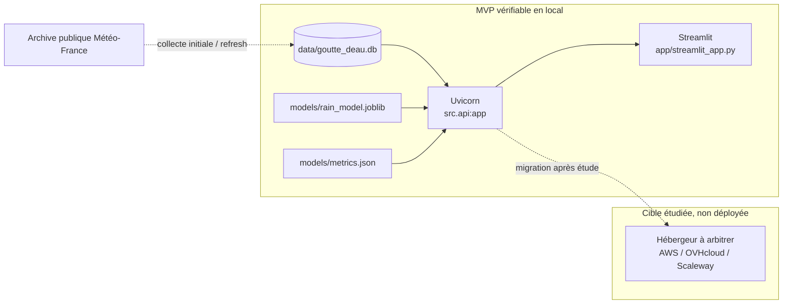

# Déploiement

```mermaid
flowchart LR
    subgraph Local["MVP vérifiable en local"]
        DB[("data/goutte_deau.db")]
        MODEL["models/rain_model.joblib"]
        METRICS["models/metrics.json"]
        API["Uvicorn\nsrc.api:app"]
        UI["Streamlit\napp/streamlit_app.py"]
        DB --> API
        MODEL --> API
        METRICS --> API
        API --> UI
    end
    SYNOP["Archive publique Météo-France"] -. collecte initiale / refresh .-> DB
    subgraph Cible["Cible étudiée, non déployée"]
        CLOUD["Hébergeur à arbitrer\nAWS / OVHcloud / Scaleway"]
    end
    API -. migration après étude .-> CLOUD
```
