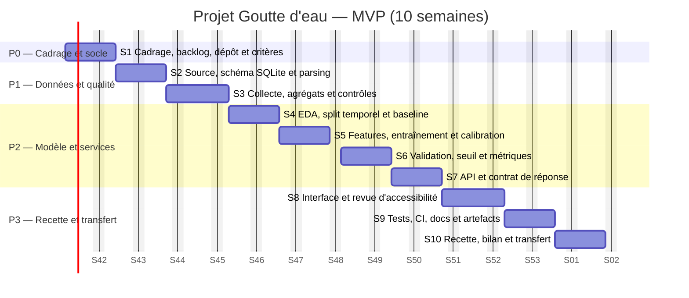

# Gantt du MVP

Le calendrier est un **cadrage relatif** de dix semaines. La date de démarrage n'étant pas fournie, le 12 octobre 2026 sert uniquement de modèle.

Les ressources prévues par sprint sont détaillées dans [`../01-planification.md`](../01-planification.md). Les capteurs IoT, l'hébergement cloud et les fonctions d'industrialisation sont hors de ce Gantt MVP.
